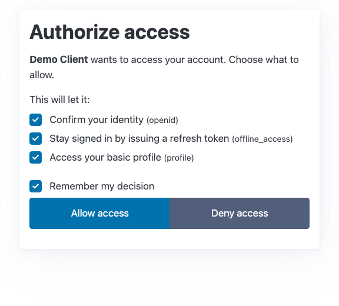
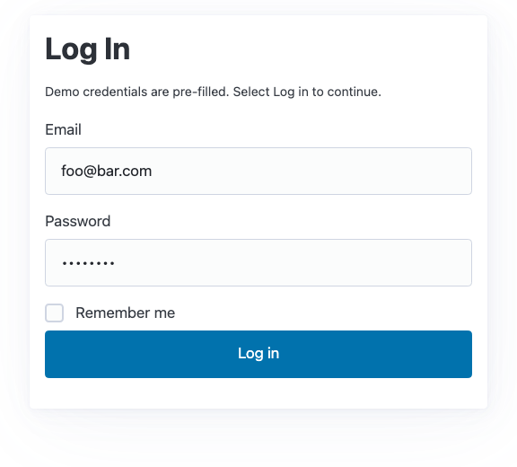
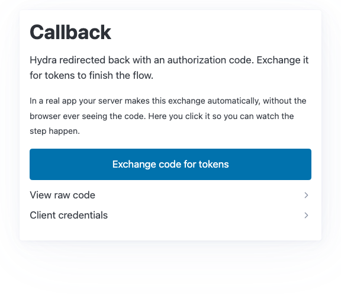
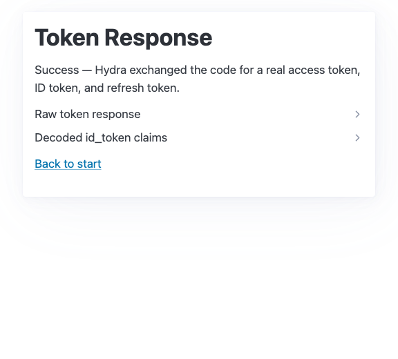

# Ory Hydra Reference Implementation - Java

[](https://github.com/ardetrick/ory-hydra-refrence-java/actions/workflows/gradle.yml)


An _unofficial_ Java reference implementation of the login, consent, and logout app that an
[Ory Hydra](https://github.com/ory) OAuth 2.0 server needs.

Ory Hydra is an OpenID Certified OAuth 2.0 and OpenID Connect server, but it is not an identity
provider — it delegates user login, consent, and logout to an app like this one. This project is
that app, built with Spring Boot and meant as a foundation to copy from, including its
[test setup](#testing), which runs against a real Hydra instead of mocks. It is not exhaustive, and
it is not guaranteed to be secure, bug free, fully tested, or production ready.

For other languages and frameworks, Ory lists reference implementations on its
[Getting Started](https://www.ory.sh/docs/getting-started/overview) page. Comparable products
include
[Spring Authorization Server](https://spring.io/projects/spring-authorization-server),
[Auth0](https://auth0.com/docs/authenticate/protocols/oauth), [Keycloak](https://www.keycloak.org/),
[Amazon Cognito](https://docs.aws.amazon.com/cognito/index.html), and [Dex](https://dexidp.io/).

Whatever you choose, do not write the oauth endpoints yourself!

## Example flow

The app implements the OAuth 2.0 authorization code flow: log in, authorize the requested scopes,
and the app exchanges the authorization code for real tokens from Hydra.



<details>
<summary>See the full flow, step by step</summary>

Log in — the demo credentials are pre-filled.



Authorize the scopes the application is requesting.


Hydra redirects back with an authorization code, which the app exchanges for tokens.



The result is a real access token, ID token, and refresh token from Hydra.



</details>

The app also implements Hydra's logout flow, and the remember-me options that let Hydra skip the
login and consent screens on a return visit.

## Running

Requirements:

- Java 21
- Docker, running

```
./gradlew bootTestRun
```

This starts the app together with a real Ory Hydra container and seeds a demo client. Open
http://localhost:8080, click "Start the OAuth flow", and log in with `foo@bar.com` / `password`;
the flow ends on a page that exchanges the authorization code for real tokens. Hydra uses its
default ports (4444 public, 4445 admin), so 4444, 4445, and 8080 must be free. See
`TestOryHydraReferenceApplication` for how the container and demo client are configured.

### Running against your own Ory Hydra

To run the app against a Hydra you manage yourself, configure your Hydra with the app's
endpoints as the login, consent, and logout URLs (`URLS_LOGIN=http://localhost:8080/login`,
and likewise `/consent` and `/logout`), then start the app with `./gradlew bootRun`. If your
Hydra's admin API is not at the default `http://localhost:4445`, point the app at it with the
`reference-app.hydra.base-path` property. The landing page at http://localhost:8080 lists whatever
OAuth2 clients your Hydra already has and includes instructions for creating one. To see each step
of the flow and token exchange as raw terminal commands, see
[walking the authorization code flow by hand](docs/manual-token-exchange.md).

<details>
<summary>Example: a minimal disposable Hydra via docker run</summary>

```
docker run --rm --name hydra \
  -p 4444:4444 -p 4445:4445 \
  -e DSN="sqlite:///tmp/db.sqlite?_fk=true" \
  -e SECRETS_SYSTEM=local-dev-secret \
  -e URLS_LOGIN=http://localhost:8080/login \
  -e URLS_CONSENT=http://localhost:8080/consent \
  -e URLS_LOGOUT=http://localhost:8080/logout \
  --entrypoint sh oryd/hydra:v26.2.0 \
  -c "hydra migrate sql -e --yes && hydra serve all --dev"
```

</details>

## Testing

The functional tests are the part most worth copying. Instead of mocking Hydra, they drive every
flow through the real browser UI against a real Ory Hydra running in a container — the same setup
`bootTestRun` uses. It is more work to wire up than mocks, but it catches the integration failures
mocks paper over, and it gives you a ready-made pattern for testing your own Hydra integration.

Run them with everything else:

```
./gradlew test
```

<details>
<summary>How the test rig works</summary>

1. Using `@SpringBootTest`, the application is started on a random port. Note that the application
   also configures two extra controllers to help facilitate testing.
2. A Playwright browser instance is created (shared by all tests).
3. A single Test Container instance of Ory Hydra is started and shared by every test in the class. It
   runs with an in-container SQLite database.
4. Before each test, a unique Hydra OAuth client is created. Hydra remembers consent per subject and
   client, so a fresh client per test keeps tests isolated on the shared container.
5. The Playwright browser loads the `/oauth2/auth` endpoint with the client's information.
6. The Playwright api is used to interact with the UI just as a user would do.
7. Optionally, the code may be exchanged for the token response.

The extra controllers created are not ideal but are useful for testing. One of them is a
`ForwardingController` which helps work around some networking challenges with a circular dependency
in configuration between the application and Ory Hydra. At start up, the application must be aware of
the urls of Hydra and Hydra must be aware of the urls of the application. In production, this would
not be an issue because static urls should be used. But in a test context both the application and
Hydra are running on dynamic ports. The second controller is `ClientCallBackController` which
provides a hook for the client call back. This allows us to verify that Hydra actually calls the
client's callback url and provides us access to the `code` value so that it can be exchanged for the
token response.

Since the token flow of OAuth is inherently UI driven, it is imperative that the UI be the driver for
the tests. To aid with this the `Playwright` framework is used. It allows us to use a headless driver
to load the UI and use HTML selectors to interact with the loaded page just like a human would.

</details>

## OpenID Connect

When the authorization code is exchanged, the token response includes an `id_token`: a JWT
describing the authenticated user. This app also attaches a custom claim, `exampleCustomClaimKey`,
which is not part of the OIDC spec, to show how to add your own (see `OryHydraRequestMapper`).

Decoded, the `id_token` from a `bootTestRun` session looks like this:

```json
{
  "at_hash": "9rz-A4HOh5aQtiQ5Rgz3AA",
  "aud": [
    "demo-client"
  ],
  "auth_time": 1785070836,
  "exampleCustomClaimKey": "example custom claim value",
  "exp": 1785074436,
  "iat": 1785070836,
  "iss": "http://localhost:4444",
  "jti": "cb8d373e-699d-4758-b0ae-fb3ef40106e4",
  "rat": 1785070836,
  "sid": "6dd2674b-19ee-4f24-950a-015e143ee300",
  "sub": "foo@bar.com"
}
```

Hydra signs the token with a rotating RSA key; the matching public keys are published at
`/.well-known/jwks.json`. Paste the `id_token` and JWKS into [jwt.io](https://jwt.io) to verify it.

<details>
<summary>Example JWKS</summary>

```json
{
  "keys": [
    {
      "use": "sig",
      "kty": "RSA",
      "kid": "9712c2d2-741e-4b58-a70f-07c2eb3be94a",
      "alg": "RS256",
      "n": "09Isnxv-Ce9nd9slEBCDDlwTPPuxcw1QYiJFFZsOfgYDMKOXbsP_ipHLqcpTmQAcnQxxm7cyo1tEagxCeri3erel-jjw8ZTLNhwiHq208XTUdX1T7RqdWHinKgGnv_JHMY6xKVtP8V-l1u_IfJnptFsQ2Q3oASarGqQxW8P-rYtnykrkfW8D81LVb7BEv-OXm4U3KyB7bCUqDm7TOsEUJuyD9LwT_cHL35oIKdYzuRUQi1UIjBMu4usv-2l4x8tWGfUHdQo3oKOufmo7ZbAKErIahPm2KyWUbmM4qrvd8vrMOdgPKJ3V-Z2ACOJJjIsShZWXH1aTdcK0L3w3M8wEzyh3Cz8ff5rtbcKUc54BM4aOSLTffg1geqiLCQZWB2eORSA_Q9TVKeFxX0v7kMSxbmLeMYq5kAMGhnepI451OAH9vkbJlqo32HN3fAPvYXIPCb5nVkkA9LOEfHYbaiXGfI0ZQISxNu1QbC9eC6fqECn9xBGpVHry3Rq6cNRX8Ut3N6TlLOnP9TxoYDprh98qfwrvEkcs3uVn8sjVaCJddlvUhFZWjCBhj5wHNYlcug8G-PLT_s-QKoXC9OOmnAcryl1d4jYQ6giJBCuuIHfs4iZxgdkKOWKt6PKOQHmZdU1xIlVqqVMY2LR25upaAijj5LcGQPilkdgVZPNpk3y7Qw0",
      "e": "AQAB"
    }
  ]
}
```

</details>

## Reference

### Technologies used

- Java 21
- Spring Boot
- Gradle
- Testcontainers
- Ory Hydra
- Docker
- Freemarker
- Lombok
- GitHub Actions

### Building against a different testcontainers-ory-hydra version

The `testcontainersOryHydraVersion` Gradle property overrides the version pinned in
`gradle/libs.versions.toml`:

```
./gradlew build -PtestcontainersOryHydraVersion=0.0.6
```

This property is relied on by the [upstream canary workflow](.github/workflows/upstream-canary.yml)
in this repository and by the pre-release compatibility workflow in
[testcontainers-ory-hydra](https://github.com/ardetrick/testcontainers-ory-hydra), so keep it
intact when refactoring the build. To build against an unreleased *checkout* of the library
instead, use a Gradle composite build:

```
./gradlew build --include-build ../testcontainers-ory-hydra
```
