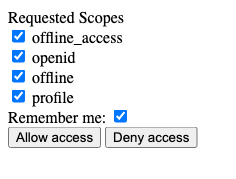

# Ory Hydra Reference Implementation - Java

This is an _unofficial_ reference implementation of the User Login and Consent flow of an 
[Ory Hydra](https://github.com/ory) OAuth 2.0 server written in Java with SpringBoot. This project demos some
key features/flows/integrations and the of OAuth 2.0 Authorization Code Grant flow. It is mean to be a foundation for
production implementations, but it is not an exhaustive implementation nor is guaranteed to be secure, bug free, fully
tested, or production ready.

Similar reference implementations can be found on the [Getting Started](https://www.ory.sh/docs/getting-started/overview)
page of the official Ory website.

## Introduction

Ory Hydra is an open source project OpenID Certified OAuth 2.0 Server and OpenID Connect Provider. Ory Hydra is not an
identity provider (user sign up, user login, password reset flow), but connects to your existing identity provider
through a login and consent app. This project is an example of such a login and consent app. It aims to be a useful
reference for other Java implementations, providing insight into not only how to integrate with Ory Hydra but also how
to effectively test the entirety of the system using SpringBootTest, Test Containers, and Playwright.

The following features have been implemented:
- [Login](https://www.ory.sh/docs/hydra/guides/login)
- [Consent](https://www.ory.sh/docs/hydra/guides/consent)
- [OIDC](https://www.ory.sh/docs/hydra/concepts/openid-connect-oidc) (with custom claims)

Similar products include but are not limited to:
- [Spring Authorization Server](https://spring.io/projects/spring-authorization-server)
- [Auth0](https://auth0.com/docs/authenticate/protocols/oauth)
- [Keycloak](https://www.keycloak.org/)
- [Amazon Cognito](https://docs.aws.amazon.com/cognito/index.html)
- [Dex](https://dexidp.io/)

Whatever you choose, do not write the oauth endpoints yourself!

## Prerequisites: What do you need to get started?

- Java 17+
- Docker (only required for running tests)
- jq (used for some demos, not a hard dependency)

## Technologies Used

- Java 17+
- SpringBoot
- Gradle
- Test Containers
- Ory Hydra
- Docker
- Freemarker
- Lombok
- GitHub Actions

## Running

### Running Functional Tests

The functional tests for this project run along all other tests with the standard gradle command.

```
./gradlew test
```

The functional tests are unique because there is practically no mocking. This makes for a slightly more complicated
setup, but it allows us to reproduce scenarios in a context very similar to what would be seen in production, all they
way from interacting with the UI back to Ory Hydra.

1. Using `@SpringBootTest`, the application is started on a random port. Note that the application also configures two extra controllers to help facilitate testing.
2. A Playwright browser instance is created (this will be shared for all tests).
3. Before each test, a new Test Container instance of Ory Hydra is started. This instance of Ory Hydra is running with an in memory database.
4. A Hydra OAuth client is created.
5. The Playwright browser loads the `/oauth2/auth` endpoint with the client's information.
6. The Playwright api is used to interact with the UI just as a user would do.
7. Optionally, the code may be exchanged for the token response.
8. Repeat from Step 3 for each test.

The extra controllers created are not ideal but are useful for testing. One of them is a `ForwardingController` which
helps work around some networking challenges with a circular dependency in configuration between the application and Ory
Hydra. At start up, the application must be aware of the urls of Hydra and Hydra must be aware of the urls of
the application. In production, this would not be an issue because static urls should be used. But in a test context both
the application and Hydra are running on dynamic ports. The second controller is `ClientCallBackController` which 
provides a hook for the client call back. This allows us to verify that Hydra actually calls the client's callback url
and provides us access to the `code` value so that it can be exchanged for the token response.

Since the token flow of OAuth is inherently UI driven, it is imperative that the UI be the driver for the tests. To aid
with this the `Playwright` framework is used. Allows us to use a headless driver to load the UI and use HTML selectors
to interact with the loaded page just like a human would.

Due to the overhead of Test Containers, the tests are a bit slow and there is likely some optimization that could be
made so that the Ory Hydra containers are re-used across each test rather than recreated for each test.

#### Playwright


#### Test Containers

### Running With Local Ory Hydra

Running the application and Ory Hydra locally is a useful way to manually interact with the application. Use the
following commands to start Hydra, start the reference application, create a client, exchange a token. 

Note: All steps require Docker and some require `jq`. All commands should run relative to the root of this repo.

#### Start Hydra And The Reference App
```
# Pull Hydra
docker pull oryd/hydra:v2.0.2

# Use the same docker-compose file used by the functional tests to start Hydra 
# with an in memory database and run the migration sccripts. 
docker-compose -f docker-compose.yml up --build

# At this point Hydra urls such as http://localhost:4445/admin/clients should be up and running.

# Open a new terminal...

# Start the Spring app. 
./gradlew bootRun

# At this point the reference app pages such as localhost:8080/index.html should load.
```

#### Demo App

Once both the app and Hydra are started, visit http://localhost:8080/demo for instructions on how interactively demo
the application. This is a more user-friendly approach than the subsequent testing instructions.

#### Create A New Client And Test Via Terminal
There may be existing clients you can use, visit to see http://localhost:4445/admin/clients.
Otherwise, follow these instructions to create a client and test it by going through the oauth flow.

```
# Create a client. Uses the Hydra container to access the Hydra CLI.
hydra_client=$(docker-compose -f docker-compose.yml exec hydra \
    hydra create client \
    --endpoint http://127.0.0.1:4445 \
    --grant-type authorization_code,refresh_token \
    --response-type code,id_token \
    --format json \
    --secret omit-for-random-secret-1 \
    --scope openid --scope offline \
    --redirect-uri http://127.0.0.1:5555/callback
)

# Put the client ID and client secret values into env variables for later use.
hydra_client_id=$(echo $hydra_client | jq -r '.client_id')
hydra_client_secret=$(echo $hydra_client | jq -r '.client_secret')
hydra_client_redirect_uri_0=$(echo $hydra_client | jq -r '.redirect_uris[0]')

# Update the client to avoid some issues with the Java SDK.
curl -X PATCH \
  http://localhost:4445/admin/clients/$hydra_client_id \
  --data-binary @patch_client_body.json

# Open a new terminal.

# Build the endpoint to initiate the OAuth flow
oauth_endpoint="http://localhost:4444/oauth2/auth?\
client_id=${hydra_client_id}&\
response_type=code&\
redirect_uri=${client_redirect_uri_0}&\
scope=openid+offline&\
state=123456789"

# Print the endpoint.
echo $oauth_endpoint

# Click on the printed endpoint (or paste it into a browser).
# Complete the OAuth flow (by default the hard coded crentials are username: foo@bar.com password: password).

# replace '...' with the `code` query param in the call back.
code=... 

# Exchange the authorization code for an access token
curl -X POST \
  -H "Content-Type: application/x-www-form-urlencoded" \
  -H "authorization: basic $(echo -n "${hydra_client_id}:${hydra_client_secret}" | base64)" \
  -d "grant_type=authorization_code" \
  -d "code=${code}" \
  -d "redirect_uri=http%3A%2F%2F127.0.0.1%3A5555%2Fcallback" \
  -d "client_id=${code_client_id}" \
  http://127.0.0.1:4444/oauth2/token
```

## OAuth 2.0 Authorization Code Grant Flow

The OAuth 2.0 Authorization Code Grant flow is a common OAuth flow that allows a client to request access to a user's
resources on a resource server. In this flow, the client first redirects the user to the authorization server to 
authenticate and authorize the client's access to the user's resources. If the user grants access, the authorization
server sends an authorization code to the client, which the client can then exchange for an access token. The access
token can then be used to access the user's resources on the resource server.


## OpenID Connect (OIDC)

[OIDC](https://openid.net/connect/) is a layer on top of OAuth. This project demonstrates some basic features of OIDC.
When the code is exchanged the response contains a `id_token` key with a JWT string. Additional information about that
token can be found [here](https://openid.net/specs/openid-connect-core-1_0.html). 

You can also see how this demo includes how to include "custom" claims that are not part of the OIDC spect.
Look in the JWT for the value `example custom claim value`.

Here is an example JWT json:

```json
{
  "at_hash": "mcH8FiS4zkwI-4tZZbow8w",
  "aud": [
    "ac844c48-bf3d-4e81-87aa-7bcf74dc092c"
  ],
  "auth_time": 1671939732,
  "exampleCustomClaimKey": "example custom claim value",
  "exp": 1671943333,
  "iat": 1671939733,
  "iss": "http://localhost:59029/integration-test-public-proxy",
  "jti": "57e6a5b7-bf6c-44c4-a8b3-5c4db55da72c",
  "rat": 1671939731,
  "sid": "b1ef49ac-f42b-457e-b3e1-295a91aaefc9",
  "sub": "foo@bar.com"
}
```

The above JWT was signed using a private key and can be verified with this JWKS public key (as fetched from 
`/.well-known/jwks.json`). Note how the response is an array but in this instance only a single key was returned.

```json
{
  "keys": [
    {
      "use": "sig",
      "kty": "RSA",
      "kid": "b6d33bf1-59d5-4abf-9646-d1f321675f2b",
      "alg": "RS256",
      "n": "yFM_NznB3GdBMNJI9YGBmzGRBx3qkTzBfReOOq2DXRBNCkoZZOMSlfv-qqruo-pfbaLwPoz2pww81h9R2hcpoZUbaLb5R3rHOmIYftjiorjzjiLnFlndY5rq3foLxZxcZ6dYBDyS3qzZgf8hUs3CH__kG4MNAAD1Hoj8pER-_jFsAyVLBXpNrIy2aiuUscnFuOtK06LbfX0OjasKSKnx_IGXMje_uA2xziA5AUy5sm4wHWhcFWNCHNH5IgP-AHmg19lm7Swd_OlFfhxg43A7AfypV4-OdBb4qhReEgNr6Fnl761gELYfgDxGZXh6o3vs-V6s4g3fMGNGk4JYHFkkCvlclAg9XaprWKFbnhA8-elqqKWNIShf32uTcajf9rMWh_4M-mLiOPDTaJsZg0_f1z-MyE2_MDe-aRURYVY7tlQYF5MnY-Hg5uxn1QEghezclPe5YWUOtI39u__DgA6X1bgQlE5n4SmvyBTuFScxTEqsidwSiIY5hJh0ek60ds16V3I-XafQ9I6JmQ1TRHxdJfpAxYH5CbroSn7lRA-Tlqd-iaJ3ZHTIBuPUa2kZGwSE8zkFPyd803FhqM-cJTtoDIS0piNd8tn6d_-KJ62jWxJeyCWiOqMvTLHdobz0p9u181l2DU7qR07J1g4qtG0pPQfs6931hLZrG6gXsd2CYfs",
      "e": "AQAB"
    }
  ]
}
```

The online tool, [jwt.io](https://jwt.io), is useful for verifying tokens during testing. For example, the above jwt is verified with the
above jwk [like this](https://jwt.io/#debugger-io?token=eyJhbGciOiJSUzI1NiIsImtpZCI6ImI2ZDMzYmYxLTU5ZDUtNGFiZi05NjQ2LWQxZjMyMTY3NWYyYiIsInR5cCI6IkpXVCJ9.eyJhdF9oYXNoIjoibWNIOEZpUzR6a3dJLTR0Wlpib3c4dyIsImF1ZCI6WyJhYzg0NGM0OC1iZjNkLTRlODEtODdhYS03YmNmNzRkYzA5MmMiXSwiYXV0aF90aW1lIjoxNjcxOTM5NzMyLCJleGFtcGxlQ3VzdG9tQ2xhaW1LZXkiOiJleGFtcGxlIGN1c3RvbSBjbGFpbSB2YWx1ZSIsImV4cCI6MTY3MTk0MzMzMywiaWF0IjoxNjcxOTM5NzMzLCJpc3MiOiJodHRwOi8vbG9jYWxob3N0OjU5MDI5L2ludGVncmF0aW9uLXRlc3QtcHVibGljLXByb3h5IiwianRpIjoiNTdlNmE1YjctYmY2Yy00NGM0LWE4YjMtNWM0ZGI1NWRhNzJjIiwicmF0IjoxNjcxOTM5NzMxLCJzaWQiOiJiMWVmNDlhYy1mNDJiLTQ1N2UtYjNlMS0yOTVhOTFhYWVmYzkiLCJzdWIiOiJmb29AYmFyLmNvbSJ9.ZRCh1sjNBIe8N_XZm97JeOpJN-T4zB3M8-PH_B-9k3cNLK3u9Ku0nBXTxQ99idrlrxyWQPT7qQK5dAzBis3M2SJ36sWq5BMjGi7bq_nU_Cj_1hzo1HTcdHXkh9iMH4zyBeQPz8BTVGgVE3rSd3tsCOMiwub7Wp3sQKDSHkCkSs6zZcsCCJS9AVQym4ltJyayYJ2lXUg7XMzuFWeyAhuVrusY8wXDv4NRIZOM6ymtHOTxe9UUVKgO8sCnUAVLqz_w2aQIYRy-u-BpT09uEalqTo27rKrUZhHjOd3LgGGVVSGp5_RM_wpK4zkiA0G7CEpU39t0ib6Ix7VWxquGWKaLIA2YqKn3ZGkTdGlByPx5N8ubPtaOxzmlgafbNTjmXxBMXU03hUXCiSaZefBZFB9jiE92-6ZKKvAFqAoaMVWp6QF4wXx3LzQzBr_EBDdH0CwhUmt_rhThj0rp_VVgQ3yr0TV7UAQGaZEO-kMJblMUjhxhK7ZMBlFXC2g7pt9zuvXhdX32QOJQ-xc20vA_RX-Kkp-Nkv3JmNCSsf-jxfwECOr_mKN7_uj7MiPK6_6zUQyrfOMKRHZcJoTlSqZylCaRn1CDxnN-1aTQ_RTplC_E27KD2TYykqc-aUGr0vkRnOGfezP3vFGNvofTfCnzZcgNJs_yTSCim1nkD5CKZEjyIhQ&publicKey=%7B%0A%20%20%20%20%20%20%22use%22%3A%20%22sig%22%2C%0A%20%20%20%20%20%20%22kty%22%3A%20%22RSA%22%2C%0A%20%20%20%20%20%20%22kid%22%3A%20%22b6d33bf1-59d5-4abf-9646-d1f321675f2b%22%2C%0A%20%20%20%20%20%20%22alg%22%3A%20%22RS256%22%2C%0A%20%20%20%20%20%20%22n%22%3A%20%22yFM_NznB3GdBMNJI9YGBmzGRBx3qkTzBfReOOq2DXRBNCkoZZOMSlfv-qqruo-pfbaLwPoz2pww81h9R2hcpoZUbaLb5R3rHOmIYftjiorjzjiLnFlndY5rq3foLxZxcZ6dYBDyS3qzZgf8hUs3CH__kG4MNAAD1Hoj8pER-_jFsAyVLBXpNrIy2aiuUscnFuOtK06LbfX0OjasKSKnx_IGXMje_uA2xziA5AUy5sm4wHWhcFWNCHNH5IgP-AHmg19lm7Swd_OlFfhxg43A7AfypV4-OdBb4qhReEgNr6Fnl761gELYfgDxGZXh6o3vs-V6s4g3fMGNGk4JYHFkkCvlclAg9XaprWKFbnhA8-elqqKWNIShf32uTcajf9rMWh_4M-mLiOPDTaJsZg0_f1z-MyE2_MDe-aRURYVY7tlQYF5MnY-Hg5uxn1QEghezclPe5YWUOtI39u__DgA6X1bgQlE5n4SmvyBTuFScxTEqsidwSiIY5hJh0ek60ds16V3I-XafQ9I6JmQ1TRHxdJfpAxYH5CbroSn7lRA-Tlqd-iaJ3ZHTIBuPUa2kZGwSE8zkFPyd803FhqM-cJTtoDIS0piNd8tn6d_-KJ62jWxJeyCWiOqMvTLHdobz0p9u181l2DU7qR07J1g4qtG0pPQfs6931hLZrG6gXsd2CYfs%22%2C%0A%20%20%20%20%20%20%22e%22%3A%20%22AQAB%22%0A%20%20%20%20%7D).

## Example Flows

### Full OAuth Flow With OIDC

A visual guide of walking through the flow from login to code.

First step is to log in.


Then scopes are requested.



Finally, the browser is redirected to the client where the code can be exchanged.


After exchanging the code the client will have a JWT (not pictured).

### Use 'Remember Me' To Skip Consent Screen

Demonstrates the impact of the "remember me" functionality. On first iteration of login, the scope screen is displayed.
On the second attempt to login (requesting the same set of scopes in the oauth url) that UI step is skipped.

Login:


Select scopes: 


Get token:


Login again:


Get token (no scopes screen):


## Task List

- [ ] Add a fancier UI
- [ ] Refactor controller/service logic to be more consistent
- [ ] Tests to mock Ory Hydra responses
- [ ] Allow rejecting on consent screen
- [ ] Add more unit tests
- [ ] Document playwright usage
- [ ] Show login errors on login screen
- [ ] Add playwright traces https://playwright.dev/java/docs/trace-viewer-intro
- [ ] Log out
- [ ] Add example with Ory Cloud

## Additional Notes
